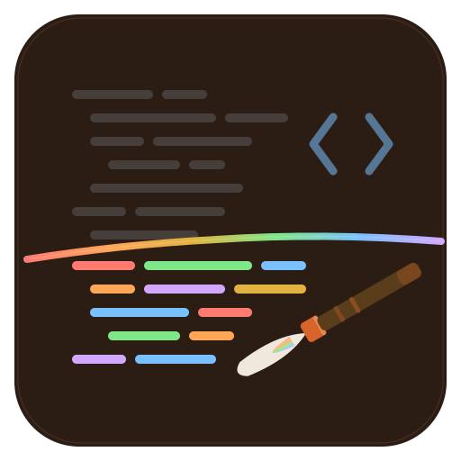
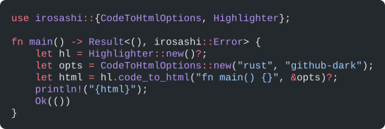

<p align="center">
  
</p>

<h1 align="center">Irosashi</h1>

<p align="center">
  <a href="https://crates.io/crates/irosashi"></a>
  <a href="https://docs.rs/irosashi"></a>
  <a href="LICENSE"></a>
  
</p>

<p align="center">
  <a href="https://docs.rs/irosashi">API reference</a> ·
  <a href="FIDELITY.md">Fidelity report</a> ·
  <a href="docs/perf/2026-09-14-bench.md">Benchmarks</a> ·
  <a href="https://github.com/frostybee/irosashi/releases">Releases</a>
</p>

## Table of Contents

- [Why native Rust?](#why-native-rust)
- [Features](#features)
- [Installation](#installation)
- [Quick Start](#quick-start)
- [API Overview](#api-overview)
- [Examples](#examples)
- [Kazari: the presentation layer](#kazari-the-presentation-layer)
- [Supported Languages and Themes](#supported-languages-and-themes)
- [Performance](#performance)
- [Relationship to Upstream Shiki](#relationship-to-upstream-shiki)
- [Development](#development)
- [Status](#status)
- [License](#license)

---

Shiki's output without Shiki's runtime. Irosashi (色差し, "applying colour") is a Rust port of
[Shiki](https://shiki.style), the TextMate grammar-based syntax highlighter used by VS Code:
257 languages, 65 VS Code themes, byte-identical tokens and HTML, incremental per-line
tokenization, and Typst output. No Node, no browser and no WASM in the process.

It runs the real [Oniguruma regex engine](https://github.com/kkos/oniguruma) natively through
the [`onig-regset`](https://crates.io/crates/onig-regset) crate, searching a whole pattern set
per call, for bug-for-bug compatibility with Shiki's tokenizer.

234 of 234 tested grammars (100%) produce output byte-identical to Shiki, verified against
[vscode-textmate](https://github.com/microsoft/vscode-textmate) across both `github-dark` and
`github-light` (468 of 468 grammar/theme pairs). The Shiki HTML preset is byte-identical to
Shiki 4.4.3 on generated goldens. See [FIDELITY.md](FIDELITY.md).

<p align="center">
  
</p>

<p align="center"><em>Rust code highlighted with <code>github-dark</code>, rendered as SVG by Irosashi (<code>cargo run -p irosashi --example svg</code>).</em></p>

The workspace has three crates:

- `irosashi`: tokenizer, grammar compiler, theme resolution, token APIs, renderers (HTML, ANSI,
  SVG, JSON, plain text).
- `kazari-rs`: presentation layer on top of `irosashi` (fence meta, transformers, line numbers,
  markers, decorated HTML, Typst output, `kazari.config.yaml`).
- `irosashi-fidelity`: fixture comparison and scoring against `vscode-textmate` output, plus
  the benchmarks.

## Why native Rust?

Irosashi exists for programs that cannot call Shiki: Rust desktop apps, command-line tools,
servers and PDF pipelines. Shelling out to Node.js or embedding a WASM Shiki bundle adds a
runtime dependency, a subprocess and a non-Rust API surface. If a project already runs on Node,
Shiki is the right choice. Where Irosashi earns its place:

- **No JavaScript runtime:** Shiki needs Node or a browser plus a WASM Oniguruma. A Rust desktop
  app, a CLI, a Typst pipeline or a Rust server cannot call Shiki without a sidecar process or
  embedding V8. That was the original reason for the project: Sarde Maker is a Tauri app, and
  Nuri, the Go engine it ships today, is 10 to 30 times slower than Irosashi on the same inputs.
- **Cold start is a different comparison:** Shiki's 20 to 90 ms cold numbers exclude Node startup
  and WASM instantiation, which add roughly 50 to 150 ms per process. Irosashi builds a
  highlighter in 1.5 ms and first-tokenizes Go in 9 ms, inside the host process.
- **Fidelity is strictly better than the alternatives in Rust:** syntect uses Sublime syntaxes and
  cannot reproduce VS Code themes and grammars byte for byte. Irosashi is at 234 of 234 grammars
  against `vscode-textmate` and byte-identical to Shiki's HTML, which no other Rust crate offers.
- **The per-line API** with an explicit state handle is designed for editors and previews that
  re-tokenize from a dirty line. Shiki's `codeToHtml` is whole-document.
- **Typst output** through Kazari, for PDF export in the same process that renders the preview:
  `render_with_meta_typst` emits a `#code-block(...)` call with the same colours as the HTML,
  and `kazari_rs::typst_preamble()` ships the template that draws it.

## Features

- **Full TextMate grammar engine:** begin/end, begin/while, captures, backreferences, injections,
  nested grammars, `$self`/`$base`/`#repo` includes, `\G` anchoring
- **Six output formats:** HTML, ANSI terminal, SVG, JSON, plain text, raw tokens
- **Multi-theme mode:** tokenize once, resolve several themes as CSS variables or a single
  `light-dark()` declaration
- **Per-line session API:** incremental tokenization with an explicit `StateStack` handle
- **Transformer pipeline:** notation comments (`[!code ++]`, `[!code highlight]`), meta string
  ranges (`{1,3-5}`), visible whitespace, custom hooks
- **Style-to-class mode:** deterministic hashed class names instead of inline styles, with one
  shared stylesheet across code blocks
- **Two HTML dialects:** Irosashi's own (`.iro` classes, `--iro-*` variables) or a byte-identical
  Shiki preset (`shiki` classes, `--shiki-*` variables, hast escaping)
- **WCAG contrast correction:** optional foreground adjustment against the theme background
  (`HighlighterBuilder::min_contrast`, off by default)
- **Language detection:** by file extension, exact filename, or first-line shebang
- **Embedded assets:** 257 grammars and 65 themes compiled into the binary (feature
  `embedded-assets`, on by default), or loaded from a directory
- **No panics on any input:** grammar parsing and tokenization are fuzz targets; a per-line panic
  is caught and reported as a `Diagnostic`
- **Deterministic output:** attributes and styles in sorted key order, class hashes stable across
  runs

## Installation

Requires **Rust 1.93** or later and a C compiler for the vendored Oniguruma build (`onig-sys`).
On Windows, Visual Studio with the VC tools component works. On Linux and macOS, a system `cc`
is enough.

```toml
[dependencies]
irosashi = "0.1"
kazari-rs = "0.1"   # optional: decorated HTML, Typst, fence meta
```

## Quick Start

```rust
use irosashi::{CodeToTokensOptions, Highlighter};

let highlighter = Highlighter::new()?;
let result = highlighter.code_to_tokens(
    "fn main() {}",
    &CodeToTokensOptions::new("rust", "github-dark"),
)?;
for line in &result.lines {
    let text = result.line_text(line);
    for token in &line.tokens {
        let color = token.style.color.map(|c| result.color(c));
        println!("{:?} {:?}", token.text(text), color);
    }
}
```

`Highlighter::new()` uses the 257 grammars and 65 themes embedded in the crate.
`HighlighterBuilder` loads assets from a directory, registers extra grammars, themes, aliases
and file extensions, and sets a maximum line length. `code_to_tokens_multi` tokenizes once and
styles for several themes; `session(lang)` gives a per-line tokenizer with an explicit state
handle for editors.

## API Overview

### Constructor and Builder

```rust
use irosashi::{Highlighter, HighlighterBuilder};

// Embedded assets (257 grammars, 65 themes).
let highlighter = Highlighter::new()?;

// Custom configuration on top of the embedded assets.
let highlighter = HighlighterBuilder::embedded()
    .grammar("my-lang", grammar_json)
    .theme("my-theme", theme_json)
    .alias("sh", "shellscript")
    .extension("mjs", "javascript")     // extension without the dot
    .max_line_length(10_000)            // longer lines are emitted unstyled with a diagnostic
    .min_contrast(5.5)                  // WCAG ratio; not set by default
    .build()?;

// Load `grammars/{name}.json` and `themes/{name}.json` from a directory instead.
let highlighter = HighlighterBuilder::from_dir("path/to/assets").build()?;
```

### Highlighting Methods

```rust
fn code_to_tokens(&self, code: &str, opts: &CodeToTokensOptions) -> Result<TokensResult, Error>
fn code_to_tokens_multi(&self, code: &str, lang: &str, themes: BTreeMap<String, String>) -> Result<TokensResult, Error>
fn code_to_html(&self, code: &str, opts: &CodeToHtmlOptions) -> Result<String, Error>
fn code_to_html_with(&self, code: &str, opts: &CodeToHtmlOptions, renderer: &mut HtmlRenderer) -> Result<String, Error>
fn code_to_ansi(&self, code: &str, opts: &CodeToAnsiOptions) -> Result<String, Error>
fn code_to_svg(&self, code: &str, opts: &CodeToSvgOptions) -> Result<String, Error>
fn code_to_json(&self, code: &str, opts: &CodeToJsonOptions) -> Result<String, Error>
fn code_to_plaintext(&self, code: &str, lang: &str) -> Result<String, Error>
fn session(&self, lang: &str) -> Result<Session, Error>
```

### Options

```rust
CodeToTokensOptions { lang, theme, include_scopes, max_line_length }
CodeToHtmlOptions   { tokens, themes: BTreeMap<String, String>, html: HtmlOptions }
                    // constructors: ::new(lang, theme), ::multi(lang, themes), .shiki()
CodeToAnsiOptions   { tokens, ansi: AnsiOptions { color_depth } }
CodeToSvgOptions    { tokens, svg: SvgOptions { font_family, font_size, line_height, pad_x, pad_y, tab_width, corner_radius, show_background } }
CodeToJsonOptions   { tokens, themes, indent }

HtmlOptions  { dialect, escape, class_prefix, var_prefix, pre_class, code_class, pre_attrs, code_attrs, default_color }
Dialect      Iro | Shiki
DefaultColor First | Key(String) | Off | LightDark
ColorDepth   Truecolor | Colors256 | Colors16 | Colors8
```

### Runtime Registration

```rust
highlighter.load_language("my-lang", grammar_json)?;
highlighter.load_theme("my-theme", theme_json)?;
highlighter.register_alias("sh", "shellscript");
highlighter.register_extension("mjs", "javascript");
highlighter.register_filename("Dockerfile", "docker");
highlighter.languages();          // every registered grammar name
highlighter.themes();             // every registered theme name
highlighter.loaded_languages();   // grammars compiled so far (lazy)
highlighter.loaded_themes();      // themes parsed so far (lazy)
```

### Language Detection

```rust
let lang = highlighter.detect_language("main.go");                    // extension or exact filename
let lang = highlighter.detect_language_by_first_line("#!/bin/bash");  // shebang / first line
```

### Theme Colours

```rust
let colors = highlighter.theme_colors("github-dark")?;
// colors.kind ("dark" or "light"), colors.foreground, colors.background,
// colors.selection_background, colors.line_highlight_background,
// colors.colors["editor.selectionBackground"], etc.
```

### Key Types

| Type | Description |
|------|-------------|
| `Highlighter` | Main entry point. Owns the registry of compiled grammars and parsed themes; cheap to share behind `Arc`. |
| `HighlighterBuilder` | Asset source, extra grammars and themes, aliases, extensions, line-length guard, contrast. |
| `TokensResult` | Output of `code_to_tokens`: source, per-line `ThemedLine`s, theme slots, colour table, diagnostics. |
| `ThemedToken` | A token with byte `start`/`end`, resolved `TokenStyle` (colour, background, `FontStyle`) and optional scopes. |
| `Session` | Per-line tokenizer for one grammar. Owns the scope interner and compiled pattern sets. |
| `StateStack` | Immutable state handle passed between `Session::tokenize_line` calls. |
| `Renderer` | Trait implemented by `HtmlRenderer`, `AnsiRenderer`, `SvgRenderer`, `JsonRenderer`, `PlainTextRenderer`. |
| `Transformer` | Trait for HTML pipeline hooks; `transformers::{Notation, Meta, Whitespace}` are built in. |
| `StyleClassMap` | Accumulates style-to-class mappings; call `css()` for the stylesheet. |
| `Diagnostic` | Non-fatal degradation record (too-long line, recovered panic). |
| `LineRange` | 1-based inclusive line range for decorations. |

### Sentinel Errors

```rust
irosashi::Error::LanguageNotFound  // unknown language name
irosashi::Error::ThemeNotFound     // unknown theme name
irosashi::Error::GrammarCycle      // cyclic grammar include detected
irosashi::Error::GrammarDepth      // grammar include depth limit exceeded
```

Other variants: `GrammarParse`, `ThemeParse`, `RegexCompilation`, `Io`.

## Examples

### HTML Output

```rust
use std::collections::BTreeMap;
use irosashi::{CodeToHtmlOptions, DefaultColor, Highlighter, HtmlOptions};

let highlighter = Highlighter::new()?;

// pre.iro.github-dark > code > span.line > span[style]
let html = highlighter.code_to_html("fn main() {}", &CodeToHtmlOptions::new("rust", "github-dark"))?;

// Light and dark in one document: inline colors from the first key, the rest as
// --iro-{key} and --iro-{key}-bg variables.
let themes = BTreeMap::from([
    ("dark".to_owned(), "github-dark".to_owned()),
    ("light".to_owned(), "github-light".to_owned()),
]);
let html = highlighter.code_to_html("fn main() {}", &CodeToHtmlOptions::multi("rust", themes.clone()))?;

// Native light/dark switching with the CSS light-dark() function, no variables or
// media queries needed. Requires theme keys "light" and "dark".
let html = highlighter.code_to_html("fn main() {}", &CodeToHtmlOptions {
    themes,
    html: HtmlOptions { default_color: DefaultColor::LightDark, ..Default::default() },
    ..Default::default()
})?;
// Emits: <span style="color:light-dark(#d73a49, #f97583)">fn</span>

// Byte-identical to Shiki's codeToHtml: shiki classes, --shiki-* variables, hast escaping.
let html = highlighter.code_to_html("fn main() {}", &CodeToHtmlOptions::new("rust", "github-dark").shiki())?;
```

### Style-to-Class Mode

Replace inline styles with deterministic hashed class names and one stylesheet for the page:

```rust
use irosashi::{CodeToHtmlOptions, HtmlRenderer, StyleClassMap};

let mut classes = StyleClassMap::new();
let html1 = highlighter.code_to_html_with(
    rust_code,
    &CodeToHtmlOptions::new("rust", "nord"),
    &mut HtmlRenderer::with_class_map(&mut classes),
)?;
let html2 = highlighter.code_to_html_with(
    js_code,
    &CodeToHtmlOptions::new("javascript", "nord"),
    &mut HtmlRenderer::with_class_map(&mut classes),
)?;
let css = classes.css(); // shared stylesheet for both blocks
```

### Transformers

```rust
use irosashi::{CodeToHtmlOptions, HtmlRenderer, transformers};

let mut renderer = HtmlRenderer::new().with_transformers(vec![
    Box::new(transformers::Notation::new()),      // [!code ++], [!code highlight], [!code focus], ...
    Box::new(transformers::Meta::new("{1,3-5}")), // highlight lines from a fence meta string
    Box::new(transformers::Whitespace::new()),    // render tabs and spaces as visible symbols
]);
let html = highlighter.code_to_html_with(code, &CodeToHtmlOptions::new("go", "github-dark"), &mut renderer)?;
```

Custom transformers implement the `Transformer` trait and override the hooks they need.

### ANSI Terminal Output

```rust
use irosashi::{AnsiOptions, CodeToAnsiOptions, CodeToTokensOptions, ColorDepth};

let out = highlighter.code_to_ansi(code, &CodeToAnsiOptions {
    tokens: CodeToTokensOptions::new("python", "dracula"),
    ansi: AnsiOptions { color_depth: ColorDepth::Colors256 }, // Truecolor is the default
})?;
print!("{out}");
```

### SVG Output

```rust
use irosashi::{CodeToSvgOptions, CodeToTokensOptions, SvgOptions};

let svg = highlighter.code_to_svg(code, &CodeToSvgOptions {
    tokens: CodeToTokensOptions::new("rust", "github-dark"),
    svg: SvgOptions { font_size: 16.0, corner_radius: 12.0, ..Default::default() },
})?;
```

### Per-Line Tokenization

For editors and previews that re-tokenize from a dirty line. `tokenize_line` takes one bare
line (no terminator) and returns raw tokens plus the state to feed into the next line; keep
the `StateStack` per line so a later edit restarts from the nearest clean line.

```rust
use irosashi::TokenizeOptions;

let mut session = highlighter.session("typescript")?;
let mut state = session.initial_state();
for (i, line) in source.lines().enumerate() {
    let result = session.tokenize_line(line, &state, i == 0, TokenizeOptions::default());
    for token in &result.tokens {
        let scopes = session.scope_names(token.scopes);
        // style `scopes` with a theme, or render them directly
    }
    if let Some(kind) = result.diagnostic {
        eprintln!("line {}: {kind:?}", i + 1);
    }
    state = result.state;
}
```

### Custom Grammar or Theme

```rust
let highlighter = HighlighterBuilder::embedded()
    .grammar("my-lang", my_grammar_json)
    .theme("my-theme", my_theme_json)
    .build()?;
```

Or at runtime:

```rust
highlighter.load_language("my-lang", grammar_json)?;
highlighter.load_theme("my-theme", theme_json)?;
```

Grammars are standard TextMate JSON. Themes are VS Code JSON themes.

### On-Disk Assets

Skip embedding entirely and load grammars and themes from disk (`grammars/{name}.json` plus
`grammars/index.json`, and `themes/{name}.json` under one root):

```rust
let highlighter = HighlighterBuilder::from_dir("/path/to/assets").build()?;
```

## Kazari: the presentation layer

`kazari-rs` turns tokens into the decorated code blocks a documentation site or a PDF wants:
fence meta parsing (`rust title="hello.rs" showLineNumbers {2-3} ins={5}`), line numbers,
highlight/insert/delete/focus markers, inline markers, titles and frames, dual themes with a
toggle, collapsible sections, output panels, toolbar buttons, a pulldown-cmark adapter with
code groups and Mermaid pass-through, and a Typst renderer. It is configured in code or from
`kazari.config.yaml`.

```rust
use kazari_rs::Kazari;

let hl = irosashi::Highlighter::new()?;
let kz = Kazari::builder(hl)
    .themes("github-light", Some("github-dark"))
    .notation_comments(true)
    .build()?;

// Decorated HTML from a fence meta string.
let html = kz.render_with_meta(code, r#"rust title="hello.rs" showLineNumbers {2}"#)?;

// Typst: a #code-block(...) call with the same colours as the HTML.
let typst = kz.render_with_meta_typst(code, "rust showLineNumbers")?;
let preamble = kazari_rs::typst_preamble(); // the template that draws it
```

The Typst path is the whole point of the presentation layer for PDF pipelines: preview in
HTML, export through `typst compile` in the same process, one set of colours.

## Supported Languages and Themes

**Embedded assets** (`embedded-assets` feature, on by default): 257 languages, 65 themes,
every grammar and theme from
[shikijs/textmate-grammars-themes](https://github.com/shikijs/textmate-grammars-themes), pinned
to the same commit Nuri uses.

**Themes include:** andromeeda, ayu-dark, catppuccin-mocha, dark-plus, dracula,
everforest-dark, github-dark, github-light, min-dark, monokai, nord, one-dark-pro, rose-pine,
slack-dark, solarized-dark, tokyo-night, vitesse-dark, and
[48 more](crates/irosashi/assets/themes/).

List available languages and themes at runtime:

```rust
println!("{:?}", highlighter.languages());
println!("{:?}", highlighter.themes());
```

## Performance

Measured on an Intel Core i9-10850K, Windows 10, rustc 1.93.0, `onig-regset` 6.7.0, theme
`github-dark`, Criterion medians. Nuri and Shiki numbers are from Nuri's `tools/compare` on the
same five snippets. Full data, the allocation audit and the cold-start breakdown are in
[`docs/perf/`](docs/perf/2026-09-14-bench.md).

Warm, small snippets (100 to 300 bytes):

| Input | Irosashi (ms) | Nuri (ms) | Shiki (ms) | Irosashi allocs | Nuri allocs |
|---|---:|---:|---:|---:|---:|
| Go (117 B) | 0.25 | 1.26 | 0.98 | 113 | 1,604 |
| HTML (304 B) | 0.30 | 4.00 | 1.23 | 230 | 2,227 |
| JavaScript (309 B) | 2.09 | 7.03 | 1.86 | 164 | 3,082 |
| Markdown (135 B) | 0.26 | 1.57 | 0.51 | | 1,856 |
| TypeScript (203 B) | 0.82 | 4.00 | 0.96 | | 2,742 |

Cold start, first call on a fresh highlighter:

| Bench | Irosashi (ms) | Nuri (ms) | Shiki (ms) |
|---|---:|---:|---:|
| `Highlighter::new()` (embedded registry) | 1.4 | | |
| first tokens, Go | 8.8 | 77 | 40 |
| first tokens, HTML | 29.5 | 354 | 48 |
| first tokens, JavaScript | 57.9 | 557 | 74 |
| first tokens, Markdown | 24.4 | 145 | 21 |
| first tokens, TypeScript | 67.3 | 677 | 88 |

Warm speed is on par with Shiki because both run Oniguruma over the same grammars; the warm
cost is the regset search itself (about 14 us per scan step on the two large grammars). Cold
time is Oniguruma compiling one pattern set per rule context on first use; parsing a grammar
costs 1.2 to 2.5 ms. Shiki's cold numbers exclude Node startup and WASM instantiation. On
50 KiB inputs Irosashi tokenizes Go at 74 ms and JavaScript at 188 ms, against Nuri's 2.4 s
and 3.4 s.

### Comparison

|                      | Irosashi    | syntect        | Shiki (JS)   | giallo        |
|----------------------|-------------|----------------|--------------|---------------|
| Languages            | 257         | ~50 maintained | 257          | 220+          |
| Themes               | 65 VS Code  | .tmTheme       | 65 VS Code   | 60+           |
| Fidelity vs VS Code  | 234/234     | N/A            | reference    | not published |
| Per-line API         | Yes         | Yes            | No           | No            |
| Typst output         | Yes         | No             | No           | No            |
| Licence              | MIT         | MIT            | MIT          | EUPL          |
| Runtime              | Native + C  | Pure Rust      | Node + WASM  | Native + C    |

## Relationship to Upstream Shiki

### What is ported

- The full vscode-textmate tokenizer state machine (begin/end, begin/while, captures,
  backreferences, `\G` anchoring, injection selectors, cross-grammar includes, while-condition
  checking) and its pattern quirks (`\z` rewrite, empty `match` no-op, `captures` fallback for
  `beginCaptures`/`endCaptures`, empty rules removed to a fixpoint)
- The Oniguruma regex engine, natively, with the real `ONIG_OPTION_NOT_BEGIN_STRING` and
  `ONIG_OPTION_NOT_BEGIN_POSITION` search options
- VS Code theme parsing, scope matching with specificity scoring, and `FontStyle` bitmask
  semantics (`NotSet` distinct from `None`)
- HTML rendering with the `<pre><code><span>` structure, multi-theme CSS variable emission, and
  a style-to-class mode
- The transformer pipeline matching `@shikijs/transformers` (notation, meta, whitespace)
- ANSI rendering with 8/16/256/truecolor depth; SVG, JSON and plain-text output

### What differs

- **Idiomatic Rust API:** builder pattern, `Result` errors, `Arc` for shared immutable data, no
  garbage collector. See [Why native Rust?](#why-native-rust).
- **Per-line session API:** `Session::tokenize_line` with an explicit `StateStack` for
  incremental editor use. Shiki's `codeToHtml` is whole-document only.
- **Two HTML dialects:** Irosashi's own output and a byte-identical Shiki preset. Pick with
  `HtmlOptions::dialect` or `CodeToHtmlOptions::shiki()`.
- **`light-dark()` mode:** a single CSS declaration per token instead of variables and media
  queries.
- **Safety is a max-line-length guard only:** no per-line timeouts, no watchdog threads. Panics
  are caught per line and reported as diagnostics.
- **Contrast correction is opt-in** (`HighlighterBuilder::min_contrast`), off by default and off
  in the fidelity harness.
- **No `codeToHast`:** renderers work from a `Node` tree; the structure is equivalent.
- **No semantic tokens:** VS Code's `semanticTokenColors` is parsed and ignored.
- **Deterministic output:** attributes and styles are emitted in sorted key order. Shiki's order
  depends on JS engine iteration order.

### Compatibility

Grammars, themes and fixtures are copied from the Nuri checkout by `tools/sync-assets`, pinned
to the same `shikijs/textmate-grammars-themes` commit Nuri uses. Fixtures are generated by real
`vscode-textmate` (Nuri's `tools/genfixtures`), never hand-written. A grammar ships in the core
set only at 100% on the shipping theme set; anything else is listed in `held.toml`.

## Development

### Build and test

```bash
cargo build --workspace
cargo test --workspace
```

### Demos

Standalone examples that exercise each output path. The Kazari HTML demo is the best starting
point for a visual overview of the presentation layer.

```bash
cargo run -p irosashi --example html > demo.html                        # three blocks: single theme, dual theme, Shiki preset
cargo run -p irosashi --example svg > example-output.svg                # the README image
cargo run -p kazari-rs --example demo > demo.html                       # decorated HTML: toolbar, collapse, output panel, theme toggle
cargo run -p kazari-rs --example demo_typst > demo.typ && typst compile demo.typ
cargo run -p kazari-rs --features markdown --example demo_markdown > demo_markdown.html
cargo run -p kazari-rs --features markdown --example showcase           # multi-page showcase site
```

### Fidelity

The core gate (32 grammars x github-dark + github-light) runs as part of `cargo test`. The full
234-grammar matrix (30 MB of fixtures) is synced locally from the Nuri checkout by
`tools/sync-assets` and is gitignored:

```bash
cargo test -p irosashi-fidelity                             # core gate: 64/64
cargo test -p irosashi-fidelity -- --ignored golden_all     # full matrix: 468/468
IRO_WRITE_REPORT=1 cargo test -p irosashi-fidelity          # regenerate FIDELITY.md
```

### HTML goldens and snapshots

```bash
cargo test -p irosashi --test html_goldens                  # 19 Shiki-preset goldens (Shiki 4.4.3)
cargo test -p irosashi --test html_snapshots                # 12 Irosashi-dialect insta snapshots
cargo insta test -p kazari-rs                               # Kazari snapshots
```

### Benchmarks

Criterion benches live in `crates/irosashi-fidelity/benches/highlight`. The inputs are the same
five snippets Nuri's `tools/compare` uses, plus the fidelity fixture sources as medium inputs
and 50 KiB repetitions as large inputs. Groups: `cold/highlighter_new`, `cold/first_tokens`,
`warm/tokens`, `warm/tokens_multi`, `warm/tokenize_line`, `warm/html/{iro,shiki,shiki_dual}`.

```bash
cargo bench -p irosashi-fidelity --bench highlight                             # full run
cargo bench -p irosashi-fidelity --bench highlight -- --save-baseline before   # save a baseline
cargo bench -p irosashi-fidelity --bench highlight -- --baseline before        # compare against it
cargo run -p bench-report                                                      # markdown table from target/criterion
```

### Allocation audit and cold-start breakdown

Both are `#[ignore]` tests that print markdown tables (allocations and bytes per call; build,
grammar parse, first line and rest-of-buffer times per language). Run in release for
meaningful numbers:

```bash
cargo test -p irosashi-fidelity --release --test alloc_audit -- --ignored --nocapture
cargo test -p irosashi-fidelity --release --test cold_start -- --ignored --nocapture
```

Results are kept in [`docs/perf/`](docs/perf/).

### Fuzz

Requires a nightly toolchain and `cargo-fuzz`. Two targets: `parse_grammar` and `tokenize`.

```bash
cargo +nightly fuzz run parse_grammar -- -max_total_time=120
cargo +nightly fuzz run tokenize -- -max_total_time=120
```

### Lint

```bash
cargo fmt --all --check
cargo clippy --workspace --all-targets -- -D warnings
```

### Assets

`crates/irosashi/assets/grammars`, `crates/irosashi/assets/themes` and the fixtures are copied
from the Nuri checkout by `tools/sync-assets`. Do not hand-edit them. Regenerating fixtures
requires Node and the `vscode-textmate` submodule in the Nuri repo (`tools/genfixtures`); it is a
deliberate, reviewed step.

### Tools

None of these are linked into the library.

| Tool | Description |
|---|---|
| `tools/sync-assets` | Copies grammars, themes and fidelity fixtures from the Nuri checkout, pinned to its upstream commit. |
| `tools/bench-report` | Reads `target/criterion` and prints the markdown table used in `docs/perf/`. |
| `tools/gen-html-goldens` | Node script that runs Shiki 4.4.3 to produce the HTML goldens for the Shiki preset. |
| `fuzz/` | `cargo-fuzz` targets `parse_grammar` and `tokenize`. |

## Status

Engine complete. Native Oniguruma via `onig-regset`, grammar compiler, tokenizer, theme
resolution, embedded assets (257 grammars, 65 themes), the fidelity gate, and HTML output in
two dialects plus ANSI, SVG, JSON and plain text. All 234 grammars are byte-identical to
`vscode-textmate` (468 of 468 grammar/theme pairs); the Shiki HTML preset is byte-identical to
Shiki 4.4.3 on generated goldens.

`kazari-rs` renders decorated HTML (line numbers, markers, focus, diff, frames, titles, dual
themes, toolbar, collapsible sections, output panels, language icons), a pulldown-cmark adapter
with code groups and Mermaid pass-through, theme adjustments and a customizer, per-block theme
override, CSS/JS minification with hashed asset names, a showcase generator, and Typst output.

## License

Copyright (c) 2026 FrostyBee.

Irosashi is licensed under the [MIT License](LICENSE). You are free to use, modify and
distribute it in both open-source and commercial projects.

Irosashi embeds third-party components (Oniguruma through `onig-regset`, TextMate grammars, VS
Code themes) under their respective licences (BSD-2-Clause, MIT and others).

---

API documentation: [docs.rs/irosashi](https://docs.rs/irosashi) · Fidelity report:
[FIDELITY.md](FIDELITY.md) · Benchmarks: [docs/perf](docs/perf/2026-09-14-bench.md)
